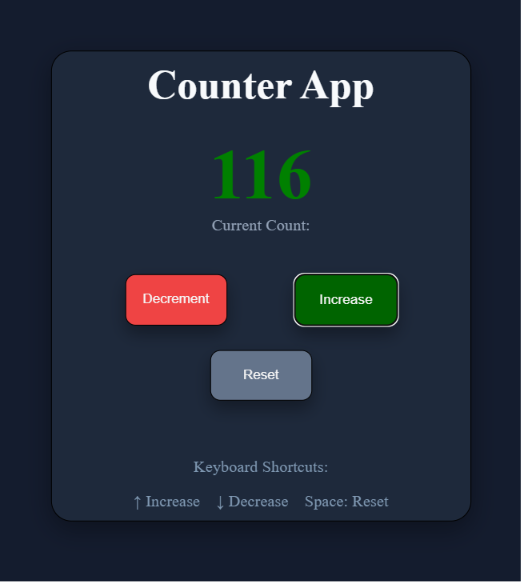

# Counter App

A simple and responsive Counter Application built using HTML, CSS, and JavaScript.

---

## ✨ Features

- Increase the counter
- Decrease the counter
- Reset the counter to zero
- Dynamic color change based on counter value
- Smooth pop animation on counter update
- Keyboard controls:
  - Arrow Up to increase
  - Arrow Down to decrease
  - Spacebar to reset
- Local Storage support to save the counter value
- Counter value persists after page refresh
- Clean and responsive user interface

---
## Keyboard Controls

- ↑ Arrow Up — Increase counter
- ↓ Arrow Down — Decrease counter
- Spacebar — Reset counter

---

## 🛠️ Technologies Used

- HTML5
- CSS3
- JavaScript (DOM Manipulation)

---

## What I Learned

- DOM element selection using `querySelector()`
- Handling click and keyboard events using `addEventListener()`
- Creating reusable JavaScript functions
- Updating the UI dynamically
- Using CSS animations and `@keyframes`
- Saving and loading data using Local Storage
- Understanding `setItem()` and `getItem()`
- Converting Local Storage strings into numbers using `Number()`
- Basic code refactoring and avoiding repeated code
- Debugging JavaScript and browser default behavior

---

## 📂 Project Structure

Counter-App/

├── index.html

├── style.css

├── Java.js

└── README.md

---

## 🚀 How to Run

1. Download or clone the repository.
2. Open the project folder in VS Code.
3. Open `index.html` in your browser.
4. Start using the Counter App.

---

## 📸 Preview

## 🎯 Future Improvements

- Add smooth counter animations
- Add Light/Dark mode toggle
- Add keyboard shortcuts
- Store counter value using Local Storage
- Improve accessibility

---

## 👨‍💻 Author

**Shamim Alam**

B.Tech Electrical Engineering Student

Learning Full Stack Web Development
